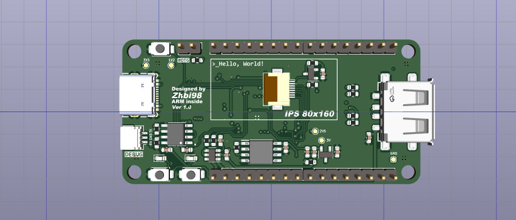

# LinuxDK

本项目是一个基于全志 F1C200s 芯片设计的超迷你&低成本的 Linux 开发板。由于 F1C200s （该芯片用于多种多媒体音视频设备中）价格便宜还能运行 Linux 系统，很适合用于新手作为入门 Linux 学习的开发板。

## 硬件介绍

(1) 一个 OLED，128x80
(2) 一个麦克风 & 功放可以外接喇叭
(3) 双面不同功能的Type-C接口分别提供USB转串口以及USB-OTG功能
(4) 一个USB-A口用于外接设备
(5) SD卡插槽
(6) 引出绝大部分IO

在 HardWare 目录下，kicad_project 就是 PCB 工程文档，原理图和 PCB 使用开源 EDA 工具 KiCAD 设计的，可以下载安装一个 KiCAD 去编辑（KiCAD 非常好用易学可以尝试学习一下，非常简单），当然这个 KiCAD 工程也支持导入到立创 EDA 中去修改。

当然这里已经将 PCB 打样使用制造输出文件（Gerber）导出了，在 gerber 目录下，可直接使用，打样时把所有 Gerber 文件压缩为 .zip 文件提供给 PCB 制造商（例如嘉立创）即可，PCB 经过我打样验证无误。

## 工具链

交叉编译器有很多，本实验使用 Linaro 出品的交叉编译器，下载地址：

https://releases.linaro.org/components/toolchain/binaries/7.2-2017.11/arm-linux-gnueabi/

或使用 ARM 发行的工具链，下载地址：

https://developer.arm.com/Tools%20and%20Software/GNU%20Toolchain

## 芯片介绍

F1C200s 基于 ARM-9 架构，芯片集成了 SiP 的 DDR 存储，外围电路可以极其简单，它支持高清视频解码，包括 H.264、H.263、MPEG 1/2/4等，还集成了音频编解码器和 I2S/PCM 接口，是一款开发简单、性价比较高的产品，也适合用来做入门级的 Linux 开发板。

这里要注意的一点是 F1C200s 的启动顺序，**f1c200s 启动顺序：**

芯片可以从 SPI Flash 或者 SD-Card 中启动，因为 Flash 容量较小可玩性不高，所以建议以 SD 卡启动为主。

参考： https://whycan.com/t_1746.html

(1) 上电后, f1c100s 内部 BROM (芯片内置，无法擦除) 启动。

(2) 首先检查 SD0 有没有插卡, 如果有插卡就读卡 8k偏移数据，是否是合法的启动数据, 如果是BROM 引导结束, 否则进入下一步。

(3) 检测 SPI0 NOR FLASH(W25QXXX, MX25LXXX) 是否存在, 是否有合法的启动数据, 如果是 BROM 引导结束, 否则进入下一步。

(4) 检测SPI0 NAND FLASH 是否存在, 是否有合法的启动数据, 如果是BROM 引导结束, 否则进入下一步；

(5) 因为找不到任何可以引导的介质， 系统进入 usb fel 模式， 可以用 USB 烧录固件二进制了。
